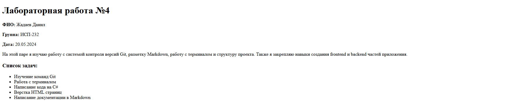

# Лабораторная работа №4 — Примеры Markdown

**ФИО:** Жадаев Данил  
**Группа:** ИСП-232  

---

## 1. Заголовки всех уровней H1–H6

# Заголовок H1
## Заголовок H2
### Заголовок H3
#### Заголовок H4
##### Заголовок H5
###### Заголовок H6

---

## 2. Горизонтальные линии

Выше и ниже этой строки находятся горизонтальные линии.

---

## 3. Форматирование текста

**Жирный текст** — выделен двойными звёздочками

*Курсив* — выделен одинарными звёздочками

~~Зачёркнутый текст~~ — выделен двойными тильдами

`Моноширный текст` — выделен обратными кавычками

---

## 4. Списки

### Маркированный список:
- Первый пункт
- Второй пункт
- Третий пункт
- Четвёртый пункт

### Нумерованный список:
1. Первый пункт
2. Второй пункт
3. Третий пункт
4. Четвёртый пункт

### Вложенный список:
- Основной пункт 1
  - Вложенный пункт 1.1
    - Глубоко вложенный 1.1.1
  - Вложенный пункт 1.2
- Основной пункт 2
  - Вложенный пункт 2.1
- Основной пункт 3

### Смешанный список:
1. Первый нумерованный
   - Вложенный маркированный
   - Ещё один вложенный
2. Второй нумерованный
   1. Вложенный нумерованный
   2. Ещё один вложенный

---

## 5. Цитаты

> Это пример цитаты в Markdown.
> Цитаты могут занимать несколько строк.
>
> И даже содержать пустые строки внутри.

> **Важно:** Цитаты можно комбинировать с другим форматированием!

---

## 6. Блоки кода

### Inline код:
Используйте команду `git status` для проверки состояния репозитория.

### Блок кода (bash):
```cs
Console.WriteLine("Привет, мир!");
```

| Команда      | Описание                    | Пример использования      |
|--------------|-----------------------------|---------------------------|
| `git add`    | Добавляет файлы в индекс    | `git add .`               |
| `git commit` | Сохраняет изменения         | `git commit -m "msg"`     |
| `git push`   | Отправляет на GitHub        | `git push origin main`    |



[GitHub — платформа для хостинга IT-проектов](https://github.com)
[Перейти к README.md](../README.md)

- [x] Создать структуру проекта
- [ ] Написать HTML код
- [x] Реализовать backend на C#

> [!NOTE]
> Это блок с примечанием. Используйте для дополнительной информации.

Формула в строке: $a^2 + b^2 = c^2$

$$
\sum_{i=1}^n i = \frac{n(n+1)}{2}
$$